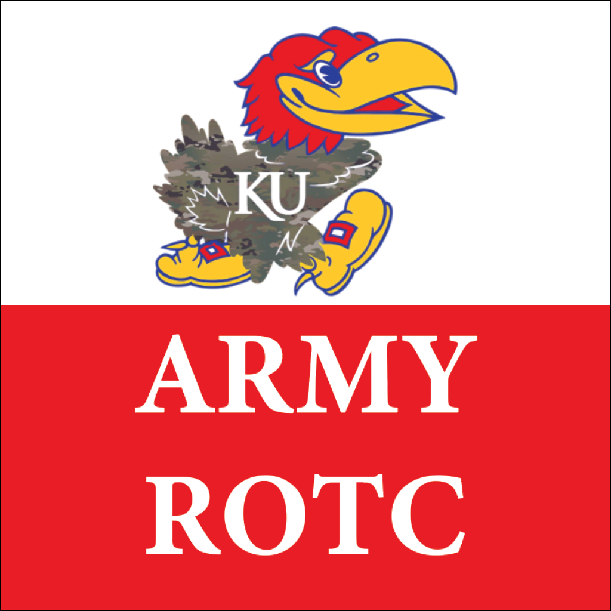

  

 

This repository contains the source code for the KU Army ROTC Digital Blue Book Mobile App. The app provides easy access to essential information needed for the KU Army ROTC program. It is intended to help cadets stay organized and prepared for their training.

## Setup
1. Download and install node.js LTS Version for your OS.
   https://nodejs.org/en/download
2. npm install -g expo-cli
3. git clone https://github.com/hortojac/KU-ARMY-ROTC-APP.git
4. cd KU-ARMY-ROTC-APP
5. npm install

## Run
1. npx expo start

## Sections of the App
- Standards
- MS1 Knowledge
- MS2 Knowledge
- MS3 Knowledge
- MS4 Knowledge
- PRT
- ACFT
- Extra Materials
- History

Each Knowledge section is designed to provide cadets with information relevant to their MS level.

